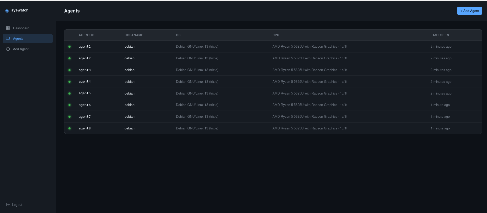
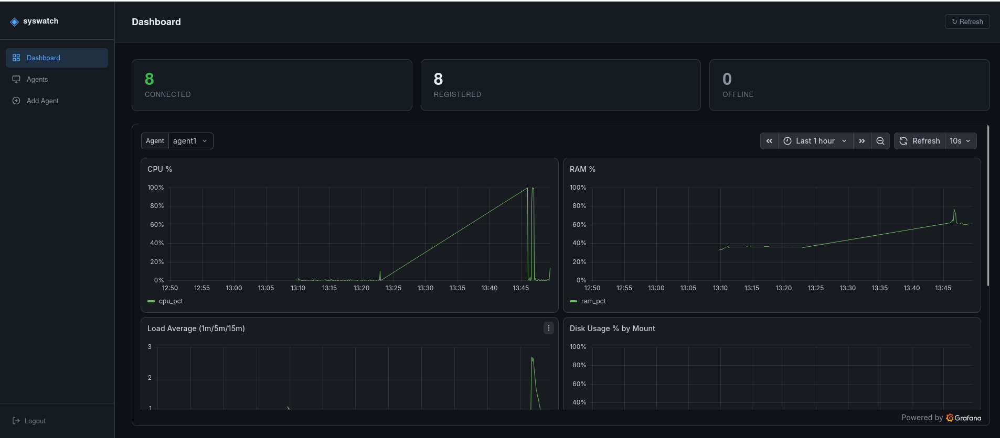
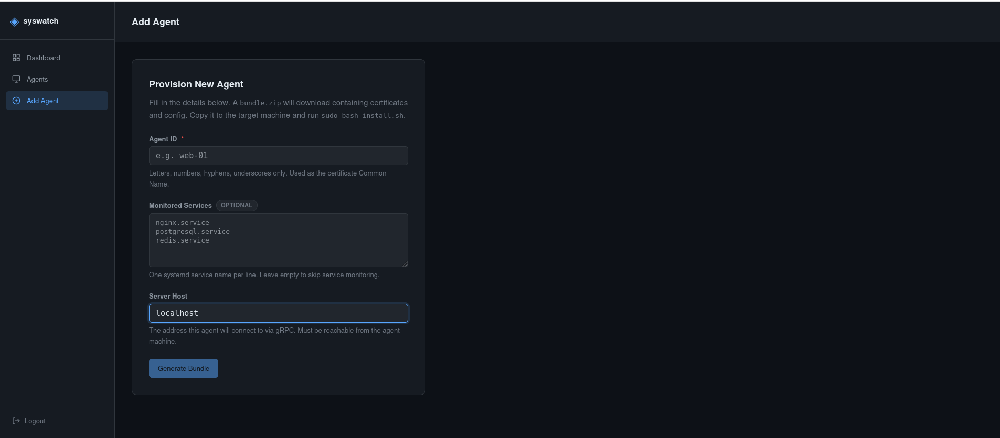

# SysWatch

Self-hosted infrastructure monitoring platform. Multi-agent metric collection over mTLS gRPC, TimescaleDB storage, embedded Grafana dashboards, FastAPI backend, React frontend.

Built as a self-hosted alternative to hosted monitoring SaaS (Datadog-class) for environments where data residency, cost, or control matter — no external telemetry, no per-host licensing, full ownership of the stack. Designed to run on bare metal, not tied to any VM or cloud provider.

---

## What This Is

SysWatch has two components:

- **`syswatch-agent`** — a lightweight daemon installed on each monitored machine. Collects CPU, RAM, swap, load average, disk usage, network interface counters, and systemd service status on a fixed interval, and streams them to the server over an authenticated gRPC connection.
- **`syswatch-server`** — the central collector. Receives agent streams, validates and writes them into TimescaleDB, exposes a REST API, serves a React dashboard, and embeds Grafana panels for time-series visualization. Also runs the internal PKI (certificate authority) that issues each agent's mTLS client certificate.

Every agent-to-server connection is mutually authenticated with TLS client certificates issued by a CA the server generates at install time. There is no shared secret or API key — an agent cannot stream metrics without a certificate signed by that specific server's CA.

## What It Does

- Collects system metrics on a configurable interval per agent (CPU%, RAM/swap %, load averages, per-disk usage, per-interface network I/O, systemd service up/down state).
- Streams metrics over a persistent bidirectional gRPC stream, with bounded queues and exponential backoff so a slow or disconnected server doesn't crash or block the agent.
- Stores metrics in TimescaleDB (PostgreSQL) as time-series data, with a daily retention sweep (default 30 days).
- Serves a web dashboard (React) showing agent inventory, online/offline state, and per-agent drill-down (CPU/RAM/disk/network history, service status).
- Embeds live Grafana panels inside the dashboard for deeper time-series exploration.
- Provisions new agents from the web UI: enter a hostname, get back a `bundle.zip` containing the agent's signed certificate, CA cert, and config — drop it on the target machine and run the installer.
- Exposes Prometheus metrics for the server process itself, and integrates with Alertmanager for alerting.

## What This Is Not

Not a log aggregator, not an APM/tracing tool, not a config management system. It is a metrics collection and visualization pipeline, scoped to host-level system telemetry.

---

## Screenshots

**Login**


**Dashboard**



**Agents panel**



**Add Agent**



---

## Architecture

**Monitored Machine — syswatch-agent**

```
Collectors (cpu, ram, disk, network, services, hostinfo)
        |
        v
    Assembler
        |
        v
     Sampler
        |
        v
     Encoder
        |
        v
  gRPC Streamer  (bounded queue, exponential backoff)
```

        |
        |   mTLS gRPC, bidirectional stream
        |   MetricFrame sent -> / <- Ack received
        v

**Central Server — syswatch-server**

```
  gRPC Servicer
        |
        v
  asyncpg buffered writer
        |
        v
  TimescaleDB (PostgreSQL)

  PKI / CA  ->  issues agent certs  ->  bundle.zip  ->  sent back to agent machine

  FastAPI
    - REST API
    - JWT (RS256) cookie auth
    - serves React/Vite dashboard (static build)
    - embeds Grafana panel (iframe, anonymous viewer role)

  Prometheus   -> scrapes server self-metrics
  Alertmanager -> receives alerts from Prometheus
```

**Agent pipeline:** Collectors -> Assembler -> Sampler -> Encoder -> Streamer, all asyncio-based with bounded queues and drop counting so backpressure never blocks collection.

**Server:** gRPC servicer accepts agent streams, writes metrics via a buffered `asyncpg` COPY writer into TimescaleDB. FastAPI serves the REST API and the built React frontend as static files. Grafana is embedded via iframe using anonymous viewer auth scoped to the syswatch dashboard. Alembic manages schema migrations. The PKI module issues each agent's client certificate and packages it into the `bundle.zip` downloaded from the dashboard.

---

## Requirements

### Server (bare metal)
- Debian 13 (Trixie), x86_64
- Root access for install
- Internet access during install (apt, PyPI, npm registries, GitHub releases for Prometheus/Alertmanager binaries)
- Python >= 3.13 (ships natively on Debian 13)
- PostgreSQL 17 + TimescaleDB (installed automatically by `install.sh`)
- Grafana OSS (installed automatically)
- Prometheus + Alertmanager (installed automatically)

### Agent (bare metal)
- Debian 13 (Trixie), x86_64 (same Python 3.13 requirement)
- Root access for install
- Network reachability to the server's gRPC port (default `50051`)
- A `bundle.zip` generated by the server for that specific agent

### Build machine
- `uv` (Python package/workspace manager)
- Node.js + npm (frontend build)
- `grpcio-tools` (proto codegen, pulled in as a dev dependency)

---

## Installation

`install.sh` is a single script with two independent modes — `agent` and `server`. There are no shared/common steps between them; each mode installs and configures only what that role needs. Both server and agent need the repo built first — do this separately on each machine, or build once and copy the relevant wheel over.

When you run `./install.sh`, it will prompt you for the path to a wheel file. This wheel is produced by `make build` and lands inside the `dist/` folder at the repo root — you point the installer at that file.

```bash
# example — what the prompt expects:
Path to wheel file: dist/syswatch_server-0.1.0-py3-none-any.whl
```

### Server installation

```bash
git clone <repo-url> syswatch
cd syswatch
sudo chmod +x bootstrap-build-env.sh install.sh
./bootstrap-build-env.sh    # sets up this Debian 13 machine for building, if needed
make build                  # generates proto stubs, builds frontend, builds both wheels into dist/
sudo ./install.sh server
```

Prompted for:
- Path to the server wheel (inside `dist/`, e.g. `dist/syswatch_server-0.1.0-py3-none-any.whl`)
- Admin username (default `admin`)
- Admin password (minimum 12 characters)

This single command installs and configures the entire stack on that machine:

| Component | Action |
|---|---|
| PostgreSQL 17 + TimescaleDB | Installed via PGDG repo, `shared_preload_libraries` set |
| Grafana OSS | Installed, anonymous viewer auth enabled, iframe embedding enabled |
| Prometheus | Downloaded (v2.52.0), scrape config written, systemd unit created |
| Alertmanager | Downloaded (v0.27.0), systemd unit created |
| PKI | 4096-bit CA + server certificate generated (`/etc/syswatch/pki/`) |
| JWT keys | RS256 keypair generated for session tokens |
| Database | `syswatch` DB + role created, TimescaleDB extension enabled |
| `config.yaml` | Templated with generated secrets, admin password bcrypt-hashed |
| Migrations | `alembic upgrade head` run automatically |
| Retention | Daily systemd timer, deletes rows older than 30 days (Apache-licensed TimescaleDB has no native retention policy — this replaces it) |
| Grafana datasource + dashboard | TimescaleDB datasource and the 6-panel syswatch dashboard imported automatically |
| systemd units | `syswatch-server`, `syswatch-retention.timer`, plus `postgresql`, `grafana-server`, `prometheus`, `alertmanager` all enabled |

On success you get a summary with the dashboard URL, Grafana URL (`admin` / `syswatch`), Prometheus, and Alertmanager URLs.

Non-interactive:

```bash
sudo SERVER_WHEEL=dist/syswatch_server-0.1.0-py3-none-any.whl \
     ADMIN_USERNAME=admin \
     ADMIN_PASSWORD='your-password-here' \
     ./install.sh server
```

### Agent installation

From the server's dashboard: **Add Agent** -> enter a hostname/agent ID -> download the generated `bundle.zip`. This contains that agent's CA-signed client certificate, key, CA cert, and `agent.yaml` config, pre-filled with the server's address. Copy that `bundle.zip` onto the target machine.

```bash
git clone <repo-url> syswatch
cd syswatch
sudo chmod +x bootstrap-build-env.sh install.sh
./bootstrap-build-env.sh    # sets up this Debian 13 machine for building, if needed
make build                  # generates proto stubs, builds both wheels into dist/
sudo ./install.sh agent
```

The same agent wheel is self-contained and can be copy-pasted to every agent machine instead of rebuilding on each one — build once, then `scp dist/syswatch_agent-*.whl` and `install.sh` to each target.

Prompted for:
- Path to `bundle.zip`
- Path to the agent wheel (inside `dist/`, e.g. `dist/syswatch_agent-0.1.0-py3-none-any.whl`)

This creates the `syswatch` system user, places certs at `/etc/syswatch/certs/`, config at `/etc/syswatch/agent.yaml`, installs the wheel into a dedicated venv, and enables the `syswatch-agent` systemd service (hardened: `ProtectSystem=strict`, `ProtectHome=true`, no capabilities).

The agent should appear online in the dashboard within one collection interval.

Non-interactive:

```bash
sudo BUNDLE_PATH=/path/to/bundle.zip \
     AGENT_WHEEL=dist/syswatch_agent-0.1.0-py3-none-any.whl \
     ./install.sh agent
```

---

## Managing the Server

A CLI shim is installed at `/usr/local/bin/syswatch`:

```bash
syswatch start | stop | restart | status
syswatch logs [-f] [-n LINES]
syswatch migrate       # apply pending Alembic migrations
syswatch health         # hit /api/health
syswatch open            # open the dashboard in a browser
```

Raw systemd/journal access also works directly:

```bash
systemctl status syswatch-server
journalctl -u syswatch-agent -f
```

---

## Configuration

Server config lives at `/etc/syswatch/server/config.yaml`. Key sections: `server` (gRPC/HTTP/metrics ports), `database` (asyncpg connection pool), `tls` (cert paths), `jwt` (RS256 keys, token expiry), `auth` (admin credentials), `pki` (agent cert issuance validity), `prometheus`/`grafana`/`alertmanager` (integration URLs), `logging`.

Agent config lives at `/etc/syswatch/agent.yaml`, generated per-agent inside `bundle.zip` — not hand-edited under normal use.

---

## Project File Structure

```
syswatch/
├── README.md
├── Makefile
├── install.sh
├── bootstrap-build-env.sh
├── pyproject.toml                        # uv workspace root
├── proto/
│   └── syswatch.proto                    # gRPC service + message definitions (shared)
│
├── syswatch-agent/
│   ├── pyproject.toml
│   └── syswatch_agent/
│       ├── __init__.py
│       ├── __main__.py
│       ├── main.py                       # syswatch-agent-daemon entrypoint
│       ├── cli.py                        # syswatch-agent management CLI
│       ├── config.py
│       ├── exceptions.py
│       ├── assembler.py                  # merges collector output into a MetricFrame
│       ├── sampler.py                    # interval-based sampling loop
│       ├── encoder.py                    # protobuf encoding
│       ├── streamer.py                   # gRPC stream client, backoff, bounded queue
│       ├── proto/                        # generated protobuf/gRPC stubs
│       │   └── __init__.py
│       └── collectors/
│           ├── __init__.py
│           ├── base.py
│           ├── cpu.py
│           ├── ram.py
│           ├── disk.py
│           ├── network.py
│           ├── services.py
│           └── hostinfo.py
│
└── syswatch-server/
    ├── pyproject.toml
    ├── alembic.ini
    ├── data/
    │   ├── syswatch-server.service       # systemd unit template
    │   ├── syswatch.desktop              # desktop entry
    │   ├── retention.sql                 # daily retention sweep query
    │   └── grafana_dashboard.json        # imported 6-panel dashboard
    ├── frontend/                         # React + Vite dashboard source
    │   ├── package.json
    │   ├── vite.config.js
    │   ├── index.html
    │   └── src/
    │       ├── main.jsx
    │       ├── App.jsx
    │       ├── api.js
    │       ├── utils.js
    │       ├── components/
    │       │   ├── Sidebar.jsx
    │       │   └── StatusDot.jsx
    │       ├── contexts/
    │       │   └── AuthContext.jsx
    │       ├── pages/
    │       │   ├── Login.jsx
    │       │   ├── Dashboard.jsx
    │       │   ├── Agents.jsx
    │       │   └── AddAgent.jsx
    │       └── styles/
    │           └── main.css
    └── syswatch_server/
        ├── __init__.py
        ├── __main__.py
        ├── main.py
        ├── cli.py                        # syswatch-server management CLI
        ├── config.py
        ├── config.yaml                   # config template
        ├── exceptions.py
        ├── proto/                        # generated protobuf/gRPC stubs
        │   └── __init__.py
        ├── grpc/
        │   ├── __init__.py
        │   ├── server.py
        │   └── servicer.py
        ├── db/
        │   ├── __init__.py
        │   ├── connection.py
        │   ├── writer.py                 # buffered asyncpg COPY writer
        │   └── queries.py
        ├── pki/
        │   ├── __init__.py
        │   └── ca.py                     # CA, cert issuance, bundle generation
        ├── web/
        │   ├── __init__.py
        │   ├── app.py
        │   ├── auth.py
        │   ├── deps.py
        │   └── routes/
        │       ├── __init__.py
        │       └── api.py
        ├── migrations/                   # Alembic
        │   ├── env.py
        │   ├── script.py.mako
        │   └── versions/
        │       └── 0001_initial.py
        ├── metrics/
        │   ├── __init__.py
        │   └── registry.py               # Prometheus metrics registry
        ├── alerts/
        │   ├── __init__.py
        │   └── alertmanager.py
        └── observability/
            ├── __init__.py
            └── tracing.py                # OTel tracing
```

---

## Security Notes

- Agent authentication is certificate-based (mTLS), not token-based — a compromised server config leak does not by itself grant agent impersonation without the CA key.
- CA and server private keys are `chmod 600`, owned by the `syswatch` system user.
- Both systemd services run with `NoNewPrivileges`, `ProtectSystem=strict`, `ProtectHome=true`, and an empty capability bounding set.
- Session auth uses RS256-signed JWTs in cookies, with separate access (15 min) and refresh (7 day) token expiry.
- Grafana anonymous access is scoped to Viewer role and used only for the embedded iframe; the underlying Grafana admin panel still requires the admin credentials set during install.

---

## Possible Setbacks

Known failure modes and their fixes.

- **`./install.sh` or `./bootstrap-build-env.sh` gives "command not found" or "permission denied"** — The script isn't marked executable on that machine (permissions don't survive some transfer methods, e.g. certain zip/scp flows). Fix: `sudo chmod +x install.sh bootstrap-build-env.sh`, then run again with `./install.sh` / `./bootstrap-build-env.sh`.

- **Grafana iframe doesn't load / blank panel on the dashboard** — Some browsers block third-party iframes by default (Safari ITP, Firefox Enhanced Tracking Protection, or strict cookie/frame policies), or the browser blocks mixed content if the dashboard is served over HTTPS but Grafana isn't. `install.sh` sets `allow_embedding = true` and enables anonymous viewer auth on the server side, but that only permits framing — it doesn't override the client browser's own framing restrictions. Fix: either allow embedding/third-party frames for the dashboard's origin in the browser's site settings, or use the "Open in new tab" link next to the embedded panel to view the Grafana dashboard directly instead of through the iframe.

- **Agent shows offline in the dashboard after install** — Usually a network path issue between agent and server on port `50051` (gRPC), not a config problem. Check with `nc -zv <server-ip> 50051` from the agent machine. If that fails, check firewall rules on the server (`nft list ruleset` or `ufw status`) — the installer does not open firewall ports automatically.

- **`syswatch-server migrate` or install fails at the Alembic step** — Usually means `alembic.ini`'s `script_location` was not patched correctly, or the wheel didn't ship `migrations/` as package data. Check `${SERVER_INSTALL_DIR}/alembic.ini` for a `script_location` pointing into the venv's `site-packages/syswatch_server/migrations`. If the directory doesn't exist, rebuild the server wheel — `make build-server` — and confirm `migrations/` is included.

- **Grafana datasource created but panels show "no default database configured"** — Means `jsonData.database` wasn't set on the datasource, only the legacy top-level `database` field. `install.sh` sets both correctly; if this occurs on a manually created datasource, add `database` inside `jsonData` in Grafana's datasource settings, not just the top-level field.

- **DNS resolution breaks after a suspend/resume cycle or inside a container-based dev environment (Podman/Distrobox)** — `systemd-resolved` can crash or detach from its socket after suspend, or lose forwarding when a Podman/Distrobox network namespace changes. Symptom: `Temporary failure in name resolution`. Fix: `systemctl restart systemd-resolved`, and if using Distrobox, re-enter the container after host network changes rather than assuming the existing session's resolver state is still valid.

- **`install.sh server` prompts fail or hang on a fresh Debian 13 machine** — Check `apt-get update` succeeded and that the PGDG and Grafana APT repo GPG keys were added correctly — a stale or missing keyring blocks `apt-get install` silently in `-qq` mode. Run the equivalent `apt-get` commands manually without `-qq` to see the real error.

- **Certificate errors on the agent (`SSL: CERTIFICATE_VERIFY_FAILED`)** — The agent's `bundle.zip` is tied to the CA of the server that generated it. If the server was reinstalled (regenerating its CA), all previously issued agent bundles become invalid — re-provision each agent from the dashboard and reinstall with the new bundle.

Questions on any part of this — architecture, a specific install step, config field — ask and I'll go deeper on that section specifically.
